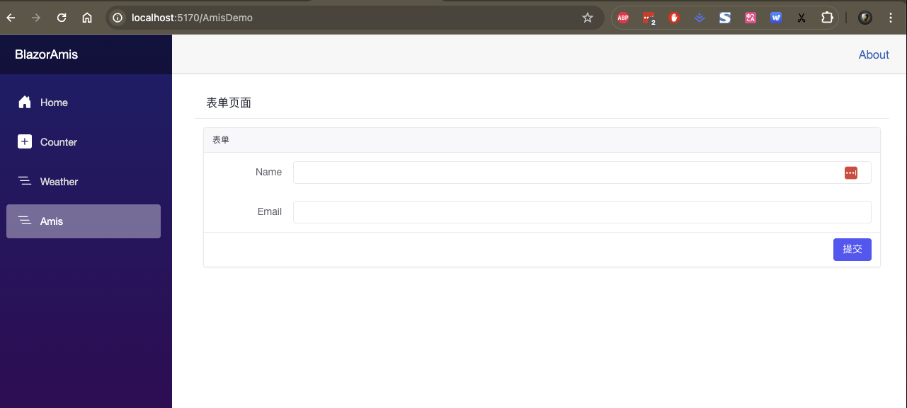

# BlazorAmis
使用Blazor 集成 百度Amis低代码平台

```csharp
<Amis Obj="GetObj()"></Amis>
```
```csharp
 return new
        {
            type = "page",
            title = "表单页面",
            body = new
            {
                type = "form",
                mode = "horizontal",
                api = "/saveForm",
                body = new[]
                {
                    new { label = "Name", type = "input-text", name = "name" },
                    new { label = "Email", type = "input-email", name = "email" }
                }
            }
        };
```

原始JSON
```js
var json={
          type: 'page',
          title: '表单页面',
          body: {
            type: 'form',
            mode: 'horizontal',
            api: '/saveForm',
            body: [
              {
                label: 'Name',
                type: 'input-text',
                name: 'name'
              },
              {
                label: 'Email',
                type: 'input-email',
                name: 'email'
              }
            ]
          }
        }
```
展示效果

